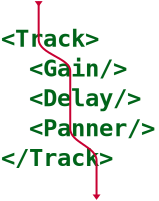
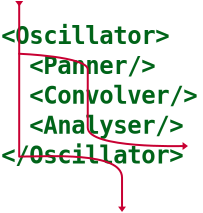

# React Audio Engine

Integração de [React](https://reactjs.org/) com [Web Audio API](https://developer.mozilla.org/pt-BR/docs/Web/API/API_Web_Audio).

## Instalação

NPM: https://www.npmjs.com/package/react-augion-engine

## Desenvolvimento

### Setup

`pnpm install`

### Demo

`pnpm start:dev`

## Especificação

## Stage

Raiz da árvore de áudio. Todas as cenas de áudio devem estar contidas em um `Stage`.

```tsx
import { ATOM, ReactATOM, Scene, Record } from "react-audio-engine";

const stage = new ATOM.Stage();

ReactATOM.render(<Scene {...props} />, stage);
```

## Scene

Responsável pela criação e gerenciamento dos contextos de áudio. Todos os demais módulos devem estar contidos em uma cena.

```tsx
import { Scene, Track, Gain, BufferSource } from 'react-audion-engine'

function MyScene(props: { masterGain: number, bugger: ArrayBuffer }) {
  return <Scene>
    <Track>
      <BufferSource buffer={props.buffer}>
      <Gain level={props.masterGain}/>
    </Track>
  </Scene>
}
```

## Record

Semelhante à `Scene`, mas renderiza o áudio em memória o mais repidamente possível.

```tsx
import { Scene, Record, Track } from "react-audio-engine";

function MyScene(props: { tracks: Track.Props[]; isSaving: boolean }) {
  const RecordOrScene = (isSaving && Record) || Scene;

  return (
    <RecordOrScene>
      {props.tracks.map(<Track {...props}>...</Track>)}
    </RecordOrScene>
  );
}
```

## Element

Responsável por renderizar os nós de áudio nativos. É uma classe abstrata cujo comportamento é implementado por todos os nós de áudio.

Os nós que concretizam `Element` são:

- [`Analyser`](./src/atom/elements/Analyser.ts)
- [`BiquadFilter`](./src/atom/elements/BiquadFilter.ts)
- [`BufferSource`](./src/atom/elements/BufferSource.ts)
- [`ConstantSource`](./src/atom/elements/ConstantSource.ts)
- [`Convolver`](./src/atom/elements/Convolver.ts)
- [`Delay`](./src/atom/elements/Delay.ts)
- [`DynamicsCompressor`](./src/atom/elements/DynamicsCompressor.ts)
- [`Element`](./src/atom/elements/Element.ts)
- [`Gain`](./src/atom/elements/Gain.ts)
- [`IIRFilter`](./src/atom/elements/IIRFilter.ts)
- [`MediaElementSource`](./src/atom/elements/MediaElementSource.ts)
- [`MediaStreamDestination`](./src/atom/elements/MediaStreamDestination.ts)
- [`MediaStreamSource`](./src/atom/elements/MediaStreamSource.ts)
- [`Oscillator`](./src/atom/elements/Oscillator.ts)
- [`Panner`](./src/atom/elements/Panner.ts)
- [`ScheduledSource`](./src/atom/elements/ScheduledSource.ts)
- [`ScriptProcessor`](./src/atom/elements/ScriptProcessor.ts)
- [`StereoPanner`](./src/atom/elements/StereoPanner.ts)
- [`WaveShaper`](./src/atom/elements/WaveShaper.ts)
- [`Worklet`](./src/atom/elements/Worklet.ts)

## Track

Conduz o sinal de áudio serialmente atráves dos módulos filhos. Sua entrada é a entrada do primeiro módulo filho e sua saída é a saída do último módulo filho.



---

## Mixer

Combina o sinal de áudio paralelamente através dos módulos filhos. Sua a entrada é a combinação das entradas dos módulos filhos e sua saída é a combinação da saída dos módulos filhos.


---

## Branch

Ramifica o sinal de áudio em um fluxo serial alternativo através dos módulos filhos cujo destino diverge do fluxo original (tendo `BaseAudioContext.destination` como destino se não fornecido explicitamente). É o comportamento implementado por todos os elementos.


